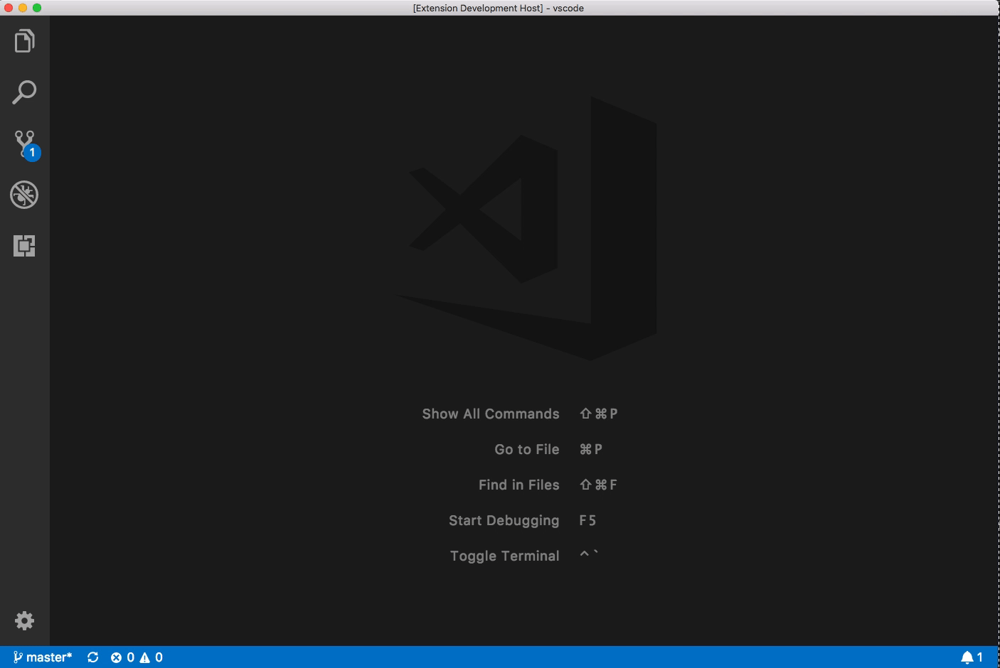

# Hello World ExTester

This is a Hello World example extension that shows you how to set up and run simple UI tests for VS Code extensions using the ExTester framework.

## Motivation

Our example extension gives us the ability to call the `Hello World` command, one that shows a notification saying `Hello World!`. We would like to write automated regression tests for this feature.



## Dependencies and Requirements

In order to run the ExTester, the extension needs two packages as dev dependencies:

- [`vscode-extension-tester`](https://www.npmjs.com/package/vscode-extension-tester) — the extension testing framework
- [`mocha`](https://www.npmjs.com/package/mocha) — required by ExTester for writing and running tests

This example also uses `chai` as the assertion library, but any assertion package works.

> **Note:** The `test-resources` folder (where VS Code binaries, ChromeDriver, logs and screenshots are stored) is excluded from the TypeScript compiler and ESLint. Add it to your `.gitignore` as well.

---

## Running the Tests from the Terminal

```bash
npm install          # install dependencies
npm run ui-test      # compile + download VS Code + run tests
```

The `ui-test` script calls `extest setup-and-run` with no extra arguments — all options are read from [`extester.config.json`](./extester.config.json) at the project root.

### What happens under the hood

1. The TypeScript sources are compiled to `out/`
2. VS Code (`max` supported version) and ChromeDriver are downloaded into `test-resources/`
3. The extension is packaged and installed into the test VS Code instance
4. Mocha runs the compiled test files matched by `./out/ui-test/*.test.js`
5. Results are written to `reports/ui-test-results.json`

---

## Configuration (`extester.config.json`)

All ExTester options are centralised in [`extester.config.json`](./extester.config.json):

```json
{
  "$schema": "./node_modules/vscode-extension-tester/resources/extester.schema.json",
  "setup": {
    "vscodeVersion": "max",
    "extensionsDir": ".test-extensions"
  },
  "run": {
    "testFiles": ["./out/ui-test/*.test.js"],
    "settings": "./settings.json",
    "extensionsDir": ".test-extensions",
    "mochaConfig": "./.mocharc.js"
  }
}
```

The `$schema` field enables inline validation and autocomplete in VS Code. All path values are resolved relative to the config file's location.

CLI flags still work and always override the config file:

```bash
# run against a specific VS Code version instead of 'max'
extest setup-and-run --code_version 1.101.0
```

---

## Running the Tests from VS Code (ExTester Runner)

The [ExTester Runner](https://marketplace.visualstudio.com/items?itemName=redhat.extester-runner) extension lets you run, browse and manage UI tests directly inside VS Code.

### Setup

1. Install the **ExTester Runner** extension from the VS Code Marketplace
2. Open this project in VS Code — the workspace already includes the required settings in [`.vscode/settings.json`](./.vscode/settings.json)
3. Click the **ExTester Runner** icon in the Activity Bar

The runner discovers test files matching the default glob (`**/ui-test/**/*.test.ts`) automatically.

### Workspace settings (`.vscode/settings.json`)

```json
{
    "extesterRunner.rootFolder": "src",
    "extesterRunner.visualStudioCode.Version": "max"
}
```

- `rootFolder` — maps source `.ts` files to their compiled `.js` counterparts in `out/`
- `visualStudioCode.Version` — VS Code version the runner passes to `extest setup-and-run`

All other options (settings file, extensions dir, Mocha config, test file glob) are picked up automatically from `extester.config.json`.

### Running tests

| Action | How |
|---|---|
| Run a single test file | Click the ▶️ icon next to the file in the **UI Tests** view |
| Run all tests in a folder | Click the ▶️ icon next to the folder |
| Run all tests | Click **Run All** in the **UI Tests** view title |

After a run, use the **Screenshots** and **Logs** views to inspect results. Run folders are sorted newest-first.

---

## Test source layout

```
src/
└── ui-test/
    ├── activityBar.test.ts
    ├── bottomBar.test.ts
    ├── commands.test.ts
    └── ...
```

Tests are written in TypeScript and import from `vscode-extension-tester`:

```typescript
import { expect } from 'chai';
import { Workbench, Notification } from 'vscode-extension-tester';

describe('Hello World command', () => {
    it('shows a notification', async () => {
        const workbench = new Workbench();
        await workbench.executeCommand('Hello World');
        const notification = await workbench.getNotifications();
        expect(notification).not.to.be.empty;
    });
});
```

See the [ExTester documentation](https://github.com/redhat-developer/vscode-extension-tester/wiki) for the full page object API reference.
